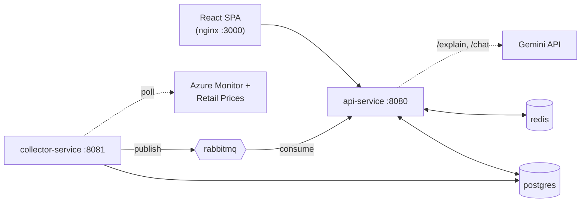

# Cloud FinSight

**AI-assisted cloud cost observability and optimization platform.**

Cloud FinSight watches an Azure VM fleet's real utilisation and live retail pricing, and turns
them into concrete, explainable rightsizing recommendations: which VMs are over-provisioned,
what SKU to switch them to, exactly how much that saves per month/year, and — via an LLM
grounded in the already-computed figures, never asked to do the math itself — a plain-language
explanation and follow-up chat about *why*.

Built as a submission for an IEEE project, but engineered like a production system: two
independently-deployable Spring Boot services talking over RabbitMQ, a five-stage scored
recommendation pipeline, JWT auth via Keycloak, and a full Prometheus/Grafana/Loki observability
stack — all reproducible with one `docker compose up`.

## Why this exists

Cloud spend on over-provisioned VMs is a silent, recurring cost: nobody notices a VM sized for
peak load that's been idling at 5% CPU for three months. Cloud FinSight closes that loop
automatically — continuously watching real usage and current market pricing, so rightsizing
opportunities surface on their own instead of waiting for a manual cost review, complete with the
reasoning ("why this SKU, why now, how confident are we") a human would otherwise have to dig up
by hand.

## Key features

- **Continuous, automatic analysis** — no manual audits. collector-service polls Azure Monitor
  and the Azure Retail Prices API on independent schedules and re-scores every VM every cycle
  (15 min by default).
- **Explainable, not a black box.** Every recommendation carries a confidence level driven by how
  much usage history actually backs it (`HIGH`/`MEDIUM`/`LOW`), a scored trade-off across cost,
  reliability, and performance, and human-readable pros/cons — see
  [docs/recommendation-engine.md](docs/recommendation-engine.md) for the full five-stage pipeline.
- **Guardrailed by design.** A candidate SKU is only ever suggested if it leaves ≥20% headroom on
  both CPU and memory versus observed usage — the engine can't recommend a resize that would
  leave a workload under-resourced.
- **LLM explanations that can't hallucinate numbers.** `/explain` and `/chat` (Gemini, via Spring
  AI) are grounded in the pipeline's already-computed savings figures and explicitly instructed
  never to calculate them itself, so the AI narrative can never contradict what's shown in the UI.
- **Real auth, real observability.** Keycloak-issued JWTs (role-gated admin actions), and a
  Prometheus + Grafana + Loki/Promtail stack watching both services out of the box — not an
  afterthought bolted on for the demo.
- **One command to stand up the whole platform.** Postgres schema (Flyway), the Keycloak realm
  and demo users, both backend services, the React dashboard, and the full monitoring stack are
  all provisioned by `docker compose up -d`.

## Tech stack

| Layer | Technology |
|---|---|
| Frontend | React 19 + TypeScript, Vite, TanStack Query, React Router, Recharts, `keycloak-js` (OIDC PKCE), served by nginx |
| Backend | Java 21, Spring Boot 4, Spring Security (OAuth2 resource server), Spring Data JPA, Spring AI (Google Gemini), Flyway |
| Data & messaging | PostgreSQL, Redis (LLM/chat caching, pricing cache), RabbitMQ |
| Auth | Keycloak (JWT issuance/validation) |
| Observability | Micrometer + Prometheus, Grafana, Loki + Promtail |
| External APIs | Azure Monitor (VM metrics), Azure Retail Prices API (live SKU pricing), Google Gemini (explain/chat) |
| Infra | Docker Compose (11 services, single-command bring-up) |

## Architecture



**collector-service** polls Azure for VM metrics and live pricing, runs a five-stage
recommendation engine, and publishes results onto RabbitMQ. **api-service** consumes those
recommendations, serves the dashboard, and answers `/explain` and `/chat` via Gemini. Both sit
behind Keycloak-issued JWTs; a Prometheus/Grafana/Loki stack watches both services.

Full breakdown, component responsibilities, and the data-flow narrative: **[docs/architecture.md](docs/architecture.md)**.

## Prerequisites

- Docker and Docker Compose
- [Azure CLI](https://learn.microsoft.com/cli/azure/install-azure-cli), logged in
  (`az login`) — collector-service needs this on the host to reach Azure Monitor (see
  [docs/local-dev-azure-auth.md](docs/local-dev-azure-auth.md))
- A [Google Gemini API key](https://aistudio.google.com/apikey) for `/explain` and `/chat`
- Java 21 + Maven, and Node 20, only if you want to run a service outside Docker

## Quick start

```bash
cp .env.example .env          # fill in real values - see Environment Variables below
az login                      # collector-service needs this to reach Azure Monitor
docker compose up -d
```

Everything is provisioned automatically: Postgres schema (Flyway), the Keycloak realm and demo
users, both Spring Boot services, the frontend, and the full Prometheus/Grafana/Loki stack.
Wait for all containers to report healthy (`docker compose ps`), then:

| | URL | Login |
|---|---|---|
| Dashboard | http://localhost:3000 | `dashboard-user` / `TestPass123` (viewer) or `admin-user` / `TestPass123` (admin) |
| Swagger UI | http://localhost:8080/swagger-ui/index.html | — |
| Grafana | http://localhost:3001 | `admin` / value of `GRAFANA_ADMIN_PASSWORD` |
| Prometheus | http://localhost:9090 | — |
| RabbitMQ management | http://localhost:15672 | value of `RABBITMQ_USER` / `RABBITMQ_PASSWORD` |
| Keycloak admin console | http://localhost:8180/auth | `KEYCLOAK_ADMIN_USER` / `KEYCLOAK_ADMIN_PASSWORD` |

New recommendations appear after collector-service's first collection + analysis cycle
completes (15 minutes by default — `collector.interval-ms` / `collector.analysis.interval-ms`
in `collector-service/src/main/resources/application.yml`).

## Environment Variables & Secrets

Copy `.env.example` to `.env` (and `cloud-finsight-ui/.env.example` to `cloud-finsight-ui/.env` if
running the frontend outside Docker) and fill in real values. Both `.env` files are gitignored and
must never be committed.

| Variable | Used by | How to obtain it |
|---|---|---|
| `POSTGRES_DB` / `POSTGRES_USER` / `POSTGRES_PASSWORD` | postgres, api-service, collector-service, keycloak | Pick any values — these just define the local database's credentials on first startup. |
| `REDIS_PASSWORD` | redis, api-service, collector-service | Pick any value. |
| `RABBITMQ_USER` / `RABBITMQ_PASSWORD` | rabbitmq, api-service, collector-service | Pick any values. |
| `KEYCLOAK_ADMIN_USER` / `KEYCLOAK_ADMIN_PASSWORD` | keycloak | Pick any values — bootstraps the admin console login at http://localhost:8180/auth. |
| `GEMINI_API_KEY` | api-service (`/explain`, `/chat` endpoints) | Create a free key at [Google AI Studio](https://aistudio.google.com/apikey). |
| `GRAFANA_ADMIN_USER` / `GRAFANA_ADMIN_PASSWORD` | grafana | Pick any values — bootstraps the admin login at http://localhost:3001. |

collector-service additionally needs an authenticated Azure session on the host to reach Azure
Monitor: run `az login` before `docker compose up` (see `docker-compose.yml` — it mounts
`~/.azure` into the container).

The local Keycloak realm (`keycloak/cloud-finsight-realm.json`) ships with fixed demo
credentials (`dashboard-user` / `admin-user`, both password `TestPass123`) and a fixed client
secret for `cloud-finsight-api`. These are intentionally hardcoded: the realm only exists inside
your local, disposable `docker compose` Keycloak instance, is reimported from this file on every
fresh start, and is not a credential to any real system.

## Running tests

```bash
# Backend (each service) - needs .env sourced for local Postgres/Redis/RabbitMQ credentials
cd api-service && set -a && source ../.env && set +a && ./mvnw test
cd collector-service && set -a && source ../.env && set +a && ./mvnw test
```

Both suites include real integration tests against Testcontainers (Postgres, RabbitMQ, and for
api-service a full Keycloak container) — no external services need to be running first; Docker
does need to be available for Testcontainers itself.

```bash
# Frontend
cd cloud-finsight-ui
npm run build   # tsc -b && vite build
npm run lint    # oxlint
```

## Project structure

```
cloud-finsight/
├── api-service/          # Spring Boot :8080 - dashboard API, auth, /explain & /chat (Gemini)
├── collector-service/    # Spring Boot :8081 - Azure polling + 5-stage recommendation engine
├── cloud-finsight-ui/    # React + TS + Vite SPA (nginx :3000, proxies /api and /auth)
├── keycloak/             # Realm export (cloud-finsight realm, demo users, client secret)
├── grafana/               \
├── prometheus/             > dashboards / scrape config / log-shipping config
├── promtail/               /
├── docs/                 # Architecture, API reference, recommendation engine, observability
└── docker-compose.yml    # Single-command bring-up of all 11 services
```

## Further documentation

- [docs/architecture.md](docs/architecture.md) — system diagram, component responsibilities, data flow
- [docs/recommendation-engine.md](docs/recommendation-engine.md) — the five-stage recommendation pipeline, with code references
- [docs/api-reference.md](docs/api-reference.md) — every REST endpoint, with example requests/responses
- [docs/observability.md](docs/observability.md) — Prometheus metric catalogue, Grafana dashboards, Loki query examples
- [docs/local-dev-azure-auth.md](docs/local-dev-azure-auth.md) — how collector-service authenticates to Azure locally
- [docs/epic-10-manual-qa-report.md](docs/epic-10-manual-qa-report.md) — the latest manual end-to-end QA pass

## License

MIT — see [LICENSE](LICENSE).
