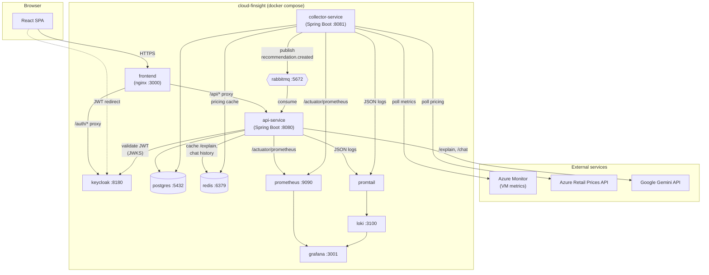

# Architecture

## System diagram

## Component responsibilities

| Component | Responsibility |
|---|---|
| **frontend** | React SPA (dashboard, recommendation detail, chat) served by nginx, which also reverse-proxies `/api/*` to api-service and `/auth/*` to Keycloak so the browser only ever talks to one origin (`:3000`). |
| **api-service** | The read/write surface for the frontend: VM inventory, cost summary, recommendation list/detail/explain/delete, and chat. Validates JWTs, consumes recommendations off RabbitMQ, calls Gemini for `/explain` and `/chat`, caches LLM responses and chat history in Redis. Owns no Azure or pricing integration itself. |
| **collector-service** | The engine: polls Azure Monitor for VM metrics and the Azure Retail Prices API for live pricing on independent schedules, runs the five-stage recommendation pipeline (see [recommendation-engine.md](recommendation-engine.md)), persists results, and publishes new recommendations onto RabbitMQ. |
| **postgres** | Single shared schema (Flyway-migrated by api-service) for VM inventory, metric snapshots, pricing snapshots, recommendations, and recommendation candidates. Both services connect to the same database — see *Why two copies of Recommendation* below. |
| **redis** | Two independent uses: api-service caches `/explain` responses (1h TTL, keyed by recommendation id) and chat conversation history (5-turn window, keyed by vmId); collector-service caches Azure Retail Prices lookups. |
| **rabbitmq** | Decouples collector-service (producer) from api-service (consumer) for new recommendations. Topology: exchange `cost-platform.recommendations` → queue `recommendations.queue` (routing key `recommendation.created`), with a dead-letter exchange/queue (`cost-platform.dlq` / `recommendations.dlq`) for messages that fail to deserialize. |
| **keycloak** | Issues and validates JWTs for the `cloud-finsight` realm. Runs behind nginx's `/auth` proxy for the browser flow, so it's configured with `KC_HTTP_RELATIVE_PATH=/auth` and `KC_PROXY_HEADERS` to keep its issued token issuer consistent with whichever path a client used to reach it (see the note in `docker-compose.yml`). |
| **prometheus / grafana / loki / promtail** | Metrics scraping + dashboards, and log aggregation + querying. See [observability.md](observability.md) for the full metric catalogue and dashboard contents. |

## Data flow narrative

1. **Collection.** On its own schedule (`collector.interval-ms`, default 15 min),
   collector-service's `MetricCollectionScheduler` queries Azure Monitor for each registered
   VM's CPU/memory metrics and persists them as `MetricSnapshot` rows. Independently
   (`collector.pricing.interval-ms`, default daily), `PricingCollectionScheduler` refreshes live
   SKU pricing from the Azure Retail Prices API into the pricing cache.

2. **Analysis.** On a separate schedule (`collector.analysis.interval-ms`, default 15 min),
   `AnalysisScheduler` runs the five-stage recommendation engine per VM against a rolling window
   of the collected metrics (default 14 days). A successful run persists a `Recommendation` +
   its scored `RecommendationCandidate`s directly into Postgres from collector-service, then
   publishes a `RecommendationMessage` onto RabbitMQ.

3. **Propagation.** api-service's `RecommendationConsumer` listens on `recommendations.queue`
   and upserts the same recommendation into its own `Recommendation`/`RecommendationCandidate`
   tables. **Why two copies of the same data, in one shared database, instead of one owning it
   exclusively?** collector-service is the only writer that ever *creates* a recommendation (it
   assigns the id), while api-service is the only service that ever mutates status
   (`PENDING`→deleted) or reads it for the dashboard — routing every new recommendation through
   RabbitMQ, rather than having api-service query collector-service's writes directly, keeps the
   two services deployable and scalable independently and gives the dead-letter queue a place to
   catch malformed messages before they ever reach api-service's table.

4. **Serving.** The browser authenticates against Keycloak (via nginx's `/auth` proxy), gets a
   JWT, and calls api-service (via nginx's `/api` proxy) for VM inventory, cost summary, and
   recommendations — all served straight from Postgres. `/explain` and `/chat` additionally call
   Gemini, grounded in the already-computed recommendation figures (the LLM is explicitly
   instructed never to calculate savings itself), with `/explain` responses cached in Redis for
   an hour and chat history kept for 5 turns.

5. **Observability.** Both services expose Micrometer metrics at `/actuator/prometheus`
   (scraped every 15s) and write structured JSON logs that Promtail ships to Loki. Grafana reads
   both, giving one place to see request rates/latency, the recommendation engine's cycle health,
   RabbitMQ queue depth, and live error logs — without needing to SSH into a container.
